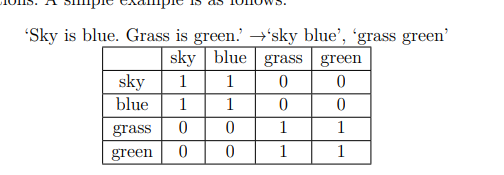
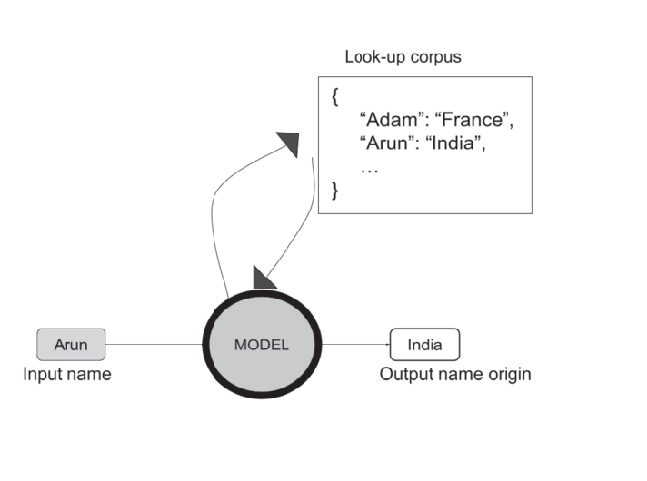
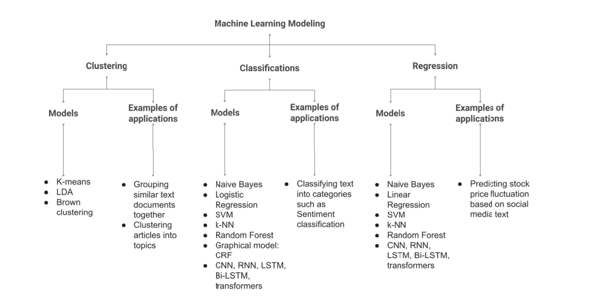
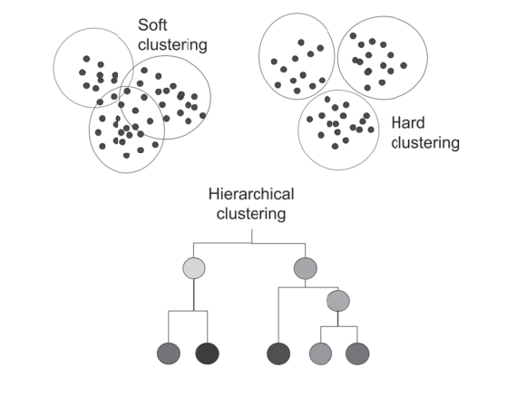

# Natural Language Processing
What is NLP?  
NLP = natural learning Programmin

 
 <h2> Libraries Download </h2>
<blockquote>

+ nltk : `!pip install nltk`
+ spacy:  `!pip install spaCy`
+ Gensim:  `!pip install gensim`
+ scikit-learn or sklearn: `!pip install scikit-learn` 
+ Tensorflow: `!pip install tensorflow`
+ Keras: `!pip install keras`
+ Torch and Torchvision: `!pip install torch torchvision`
+ Transformer (Hugging Face): `!pip install transformer`
### Libraries documentation: 
+ https://brew.sh/
+ https://chocolatey.org/
+ NLTK https://www.nltk.org/
+ https://wordnet.princeton.edu/
+ spaCy https://spacy.io/
+ Gensim https://radimrehurek.com/gensim/
+ Scikit-learn https://scikit-learn.org/stable/getting_started.html
+ TensorFlow https://www.tensorflow.org/learn
+ Keras https://keras.io/
+ PyTorch https://pytorch.org
+ Hugging Face transformers https://huggingface.co/docs/transformers/main/en/index
+ JAX https://jax.readthedocs.io/en/latest/notebooks/quickstart.html

  

 

<h2>DataSet Resources</h2>
<blockquote> 

## you can access dataset from these website
+ https://archive.ics.uci.edu/ml/datasets.php
+ https://snap.stanford.edu/data/web-Amazon.html

+ https://dumps.wikimedia.org/

+ https://nlp.stanford.edu/sentiment/index.html

+ https://www.kaggle.com/datasets/crowdflower/twitter-airline-sentiment

+ https://paperswithcode.com/dataset/standardized-project-gutenberg-corpus

+ https://www.cs.cmu.edu/~enron/

+ https://www.kaggle.com/rtatman/blog-authorship-corpus

+ https://archive.ics.uci.edu/ml/datasets/SMS+Spam+Collection

+ https://cseweb.ucsd.edu/~jmcauley/datasets.html

+ https://wordnet.princeton.edu/download

+ https://github.com/nproellochs/SentimentDictionaries

+ http://help.sentiment140.com/for-students/

+ https://www.cs.jhu.edu/~mdredze/datasets/sentiment/

+ https://www.yelp.com/dataset

+ http://qwone.com/~jason/20Newsgroups/

+ https://www.microsoft.com/en-us/download/details.aspx?id=52419

+ https://www.statmt.org/europarl/

+ http://kavita-ganesan.com/entity-ranking-data/#.Yw1NsuzMKXj

+ https://archive.ics.uci.edu/ml/datasets/Legal+Case+Reports

+ https://rajpurkar.github.io/SQuAD-explorer/

+ https://catalog.ldc.upenn.edu/LDC93s1

+ https://www.imdb.com/interfaces/

+ https://www.reddit.com/r/datasets/comments/1uyd0t/200000_jeopardy_questions_in_a_json_file/

  

<h2>Reading from a Word Document</h2>
  

+ To read the Word Document you need to install python-docx library
The whole step is shown in file name **RWordDoc.ipynb**

## Data Preprocessing in NLP
It involves
+ Data cleaning and preprocessing
+ Visualization
+ Data Augmentation
+ Distance metrics
+ Modeling
+ Model Evaluation

 

<h2>Segmentation</h2> 

  
While running Segmentation.ipynb file from repo , run this command in bash : `python -m spacy download en_core_web_sm` 
  

  
 

<h2> Word tokenization</h2>
 
    
You will find the repo by name of WordTokenization.ipynb   
Word Tokenization can be done by three different library textblob, Nltk, Spacy .. you will find the example code in the repo

<h2>Part of Speech Tagging</h2>

  
 You will find the code in POS.ipynb  
Part Of speech is also known as POS tagging
it might be desired to retain only certain parts of speech, such as nouns. The use cases can be cleaning data before creating a word-counts (bag-of-words) model or further processing that depends on parts of speech, such as named entity recognition (where two nouns occurring together are likely first and last names of a person) and keyphrase extraction.

 

 
<h2>N-grams</h2>
  
 
**You will find N-gram code in N-gram.ipynb file**
N-grams are a contiguous Sequence of N elements. For instance "Natural", "Language" and "processing" are unigrams,"natural language" and "language processing" are bigrams, and "natural language processing" is the trigram of the strirng "natural language processing"  
In many NLP feature generation methods, each word in a sentence is used as an independent unit (token) while encoding data. Instead, getting multi word pairs from a sentence can be beneficial for certain application that contain multi-word keywords or sentiment analysis.
For example: "not happy" bigram versys 'happy' unigram can convet different sentiments for the sentence 'James is not happy'

  
 ## Cleaning
  

<h2> Punctuation removal</h2>
  
 
For many applications such as category classification and word visualizations, the words used in the text matter and the punctuation does not have relevance to the application. Punctuation can be removed using a regex expression.  
In regex: 
+ \m matches a newline character
+ \w is a word character that matches any single letter number, or underscore (same as [a-zA-Z0-9])
+ \s is for matching white spaces
+ ^ is for matching with everything except the pattren specified  
**You will find Punctuation Removel code in PR.ipynb**

 

 
<h2>URL removal</h2>
  
  
In language document URL removal can be beneficial in reducing overall text length and removing information that does not convet meaning for your application  
In regex, \s matches all whits-spaces character and \S matches with non white spcaed characters
+ | stands for OR and can be used when we want to match multiple pattren with the OR logic.
**You will find the code in url.ipynb file in this repo**
 

 
 
 <h2>Emoji Removal (Day 11) </h2>

 
Unicode is an international standard that maintains a mapping of individual character and unique number acrrross devices and programs.  
Each character is represented as a code point.   
These code point are encoded in bytes and can be decoded back to code points.
+ UTF-8 is an encoding system for Unicode. UTF-8 uses 1, 2, 3, and 4 bytes to encode every code point.  
In the Unicode standard, an emoji is represented as a code. For example \U0001F600 is the combination that triggers a grimming face across all devices across the world in UTF-8. Thus, regex pattern can be used to remove emoji from the text.
**You will find the code by EmojiRemove.ipynb**    

 <h2>Spelling Checker (Day 12)</h2>

 
**You will find the code in sp_check.ipynb**  
Data Consists of spelling errors or intentional misspellings that fail to get recognized as intended by our models, especially if our models have been trained on cleaner data.  
In such cases, algorithmically correcting typos can come in handy. Linraries such as pySpellChecker, TextBlob and pyEnchant can be used to accomplish spelling corrections.

 

 

<h2>Stop Words Removal (Day 13)</h2>
  
  
**You will find stop words code in stop_words.ipynb**  
Stopwords refers to the commonly occuring words that help connect important terms in a sentence to make it meaningful. However, for many NLP applications they do not represent much meaning by themselves.Examples include "this" ,"it" ,"are" etc. This is especially useful in application using word occurrence-based features. There are libraries and data sources containing common stop words that you can use as a reference look-up list to remove those words from your text. In practice, it is common to append to an existing stop words list the words specific to your dataset  that are expected to occur commonly but don't convey important information.
**For Example** : If yu are dealing with YouTube data, then the word "video" may commonly occur without converying a unique meaning across text documents since all of them come from a video source.

 ## Standardization

<h2>Lowercasing (Day 14)</h2>

   
For Application where 'Natural Language Processing' , 'natural language processing' , and 'NATURAL LANGUAGE PROCESSING' convey the same meaning, you can lowercase your text or upper case.  
Lowercasing is a more popular choice among practitioners to standardize text
**you will find lower casing code in lower.py**

 
<h2>Stemming ( Day 15)</h2>

   
Stemming is the process of producing morphological varaints of a root word These methods help convert a word into base form called the stem  
`` scanned -> scan ``  
Stemming is not only helpful in reducing redundancies in the text as a preprocessing step, but also used in search engine applications and domain analysis for determining domain vocabularies  
Porter's stemming method is a rule-based approache introduces by Martin Porter in 1980. Like any method, this method has failure points , `` computer -> comput ``  
There are many other stemming available with NLTK , such as SnowballStemmer adn ARLSTem
**You will find Stemming code in Stemming.ipynb file**

 
 
<h2>Lemmatization ( Day 16)</h2>

  
 Lemmatization is  a process of extracing the root word by considering the various words in vocabulary that convery a similar meaning, Lemmatization involves morphological analysis of words that remove inflectional endings only to return a base word called lemma
**For example** lemmtizing the word caring would result in care, where as stemming word would result in car.
**you will find Lemmatization code in lemma.ipynb**

<h1>Example Scenario 01: ( Day 17 )</h1>

  
Cleaning is customized based on noise observed orr expected in the data. Let's say you have your text from social media. So it has a lot of punctuations, URLs, and special character. You want to build a content category classification model based on word occurrrence counts. Thus, all you need for your applications is words and maybe numbers. To do so, let's clean the text by removing everything except alphabets and numbers. Ordering your preprocessing steps correctly is important. Hence beforer we remove non-alpha-numberic characters, we'll remove URLs if we don't take orrder te steps this way, the URLs will get strripped off their usual expected forrmat that contains this way, the URLs will get stripped off their usual expected forrmat that contains punctuation, and hence identifying URRLs using the reges we wrote will not work.  
Additionally, we'll remove stop worrds. All these steps together will prepare your data for numberical transformation ( feature extraction ) steps.
**you will find example scenario code in example_scenario_01.ipynb**

 <h2>Visualization (Day 18)</h2>

   
The most popular library in python for representing text is wordcloud. Word cloud allows you to generate visualization on a body of text, where the frequency of words/phrrases is correlated with the size of the word/phrase on the plot along with its opacity.  
**You will find code in visual.ipynb**

 

<h2>ScatterTExt (day 19) </h2>

   
Scatextter allows you to extract terms in a body of text and visualized as an interactive HTML display.
**You will find the code in ScatterText.ipynb**

# Data Augmentation (day 20)
When the data available is not suffice for the task we have few methods to deal with it.  
+ Hand curating more sample, accessing similar public datasets, or purchasing relevant data from data vendors.  
**What if you couldn't find data source**
Data Augmentation refers to artificially sysnthesizing data samples based on the sample present.  
For images simply rotating an image replacing colors, adding blurs/noise, and such simple modifications help generate new data samples. For text, the problem is a bit more challenging. Popular techniques include word replacements in text. However, replacing by another or has a synonym. Nonetheless, it serves as a opilar technique to augment text data and works well for many cases.  
### Quick Note : 
+ technique may work for someone, it may not apply to the data you are dealing with. 

**Python library for augmentation data are : pyAugmentText,nlpaug, and TextAugment**
**You will find augmentation code in augment.ipynb**
 # Data Transformation :  

 
<h2>Encoding (Day 21 abd 22)</h2>
   
    
 There are two types of Encoding:
  + Label Encoding (Code will be found in LabelEncoding.ipynb)
  + One Hot encoding (Code will be found in OneHotEncoding.ipynb)

  
  # Frequency-based vectorizers  
  Text can be passed through vectorization techniques which work by breaking down the text into tokens (also called terms) and counting token occurrences in the text. Tokens can be single words, n-grams, or phrases.  
  

   
<h2>Count Vectorization  (Day 23)</h2>

     
  A count vector is formed using the count of occurences of terms comprising the text. For example 'I Like NLP like ML' -> 'I': 1, 'like':2,'NLP':1,'ML':1  
**you will find its code in CountVector.ipynb**

  
<h2>Hash vectorizer(Day 24)</h2>
    
   
+ map data of arbitrary size to fixed size values.
+ term frequency counts are passed through a hash function that transform the collection of documents into a sparse numerical matrix.  
**One advanatage over a count vectorizer is taht a count vector can get large if the corpus is large. Hash Vectorizer stores the tokens as numberical values as opposed to a string. The disadvantage of a hash vectorizer is that the features can't be retrieved once the vector is formed**
+ **you will find the code in HashVector.ipynb**

 
 
<h2>Term Frequency - inverse document frequenct (TF-IDF Day 25)</h2>

   
 TF-IDF is the count of the frequency of occurrences of tokens (also called terms) comprising the document, downweighed by importance of the terms which is calculated by dividing numvers of document frequency for a term is defined as the number of document a term is contained in divided by the total no. of documents. IDF is just the inverse of that. The IDF reflects how important each term is in a particular document frequency counts will be high, resulting in a low IDF. It is a common practice to have a threshold for min_df and max_df to ignore very highly occuring terms and very rare terms.  
 `Mathematically : TF-IDF=TF(t,d)*IDF(t)`
 **You will find TF-IDF code in Tf-TDf.ipynb**  

 
<h2>Co-occurrence matrix (Day 26)</h2>

   
 + Relationship between teh terms that occur together in a content.  
 + used for representation of indication of connection between notions.  
 ### A sample:   
   
   
**You will find Co-occurence matrix in Co_matrix.ipynb**  

  
# Word Embedding  

<h2>Wrod2Vec(day 27)</h2>
  
   
Word2Vec is trained on the Google News Dataset, which contains about 100 billion words.  
+ shallow two-layer neural networks having once input layer, one hidden layer and one output layer.  
+ Word2Vec utilize two models.
A sentence is divided into groups of n words. The model is trained by sliding the window of n words.  
        **continuous bag of words (CBOW):**  
          CBOW predicts the current word based on other words within the same context in a specific n-word window. The input layer of the neural network is the context words and the output layer contains the current word.  
        **Skip gram:**  
           Skip gram works the other way round. It predicts the surrounding context words for an input word.  
The main disadvantage of Word2Vec is that you will not have a vector represting a word taht doest not exist in the corpus.  
You can produce Wrod2Vec embeddings using the library Gensim or spaCy.  
**You will find Word2Vec code in Word2Vec.ipynb**

    

 
 
<h1>FastText: (Day 28)</h1>
  
   
This architecture considers each character in a word while learning  the words representations  
Since fastText uses character level details on a word, it is able to compute vectors for unseen words conatining the characters it has seen before.  
One disadvantage off this method is that unrelated words conatining similar character/alphabets may result in being close in the vector space without semantic closeness
**You can find the code of FastText in fasttext.ipynb**

  

<h1>GloVe:: global vectors (Day 29)</h1>
    
   
+ GloVe models train on co-occurrence counts of words and produces a vector by minimizing the lease square error.  
+ Each word in the corpus is assigned a random vector. If two words are used together often i.e they have high co-occurence, then those words are moved close in the vector space.  
+ After the various round of this process, the vector space representation approximates the information within the co-occurrence matrix.
+ In mathematical term the dot product of two word becomes approximately equal to the log of the probability of co-occurence of the words.
**You will find Glove code in GloVE.ipynb**

   

 
<h1>ELMo (Day 30)</h1>
  
   
ELMo is a deep contextualized word representation model. It considers the complex characteristics of words and how they vary across different contexts. Each term is assigned a representation that is dependent on the entire input sentence. These embeddings are derived form a Bi_lSTM model.  
ElMo can handle words with different contexts used in different sentences, which GloVE unable to. Thus the same word with multiple meanings can have a different embeddings
**ELMo is trained on a large text corpus comprising 5.5 billion words**
**You will find code in ELMo.ipynb**  

  

<h2>Universal Sentence Encoder Day (31)</h2>
  
   
Universal Sentence Encode model is based on transfer learning and is a sentence-level encode. It encodes text to high dimensional vectors and finds application in text classification, semantic similarity, clustering and more.  
**It is trained on Wikipedia, web news, web question-answer pages and discussion forums**  
**You will find its code in USE.ipynb**

     

<h2>Transformer (Day 32)</h2>
  
There are many models offered with sentence-transformers that can be used to generate embeddings. Different models are suitable for different applications.  
  
**You will find transformer code in transformer.ipynb**

  
  
# Data Modeling
## Distance Metric  
Many NLP applications in NLP comprise tasks such as computing similarity between two pieces of text. This can be at different levels - word level, phase level, sentence level, and document level. The interest may be to find syntactic similarity or semantic simialrity.  
Moreover, the similarity measure can be in different contexts. Are the words related in the way they are spelled or sound? are the words similar in their meaning? 
Lets found out by looking into some famous and well known similarity metric below : 
### Semantic similarity metrics  
+ Calculated using numerical representation of text 

<h4>Euclidean Distance</h4>

  
+ distance between two points connecting a path.  
+ distance is useful when the length of text palys a role in determining similarity.  
+ if the length of the sentence is doubled by repeating the same sentence twice, the euclideaan distance will increase even though the sentence may have the same meaning.  

**you will find euclidean distance code in euclidean_distance.ipynb**   

  

<h4>Cosine similarity</h4>

  
Cosine distance is the most popularly used metric for measuring distance when the difference in document lengths(magnitude of the vectors) do not matter. 
+ the occurences of terms within each sample follow to the same distribution   
`Cosine similarity = 1 - Cosine distance`  
**You will find its code in Cosine_dist.ipynb**

  
   
 *When To use Which metrics*  
 `we build a numerical vector for each document that is computed based on the counts of words present. The magnitude of the vector may vary if the counts of words in two sentence is differ, eveb though the two sentences are similar otherwise. This will give rise to a higher Euclidean distance. The main advantage of cosine similarity is that it does not depend on the length difference. If the two similar documents are far apart by the Euclidean distance becuase of the length,(for example 50 occurrences of the word "basketball" in one document versus 10 occurrences of the same word in another) they could still have a smaller angle between them. Smaller the angle, the higher the similarity`

<!-- ### Character based-similarity (Day 33):  
Character level similarity looks at how different two string are from one anotehr based on characters with in.  
A poular approach to measure this difference is called Longest Common Sub-string, which finds the maximum length of a contiguous chain of character from both strings being compared. Applications include data deduplication and plagiarism detection.  
Another popular measure is called Levenshtein edit distance. This distance is calculated between two strings by counnting the minimum number of operations needed to tranform one string into the other. The operations include insertion, deletion, replacement, or subsitution of a character. A common application is seppling correction.  
Hamming distance refferes to the number of positions with same character in both strings. This only works on strings with the same length.  
~**You will find the code in pyStringMatching.ipynb**~
**-Due to some library issues this code is incomplete but we will continue our session-**
### Phonetic Matching Day 34:-  
Phonetic matching is similar between two words on how they may sound rather than their precise spelling. The process include creating an alphanumeric code for an input and comparing the code of two words. Applications include spelling corrections and searching large text corpora. Soundex and Metaphone are two popular phonetic algorihtm. -->  

# Modeling  
Generally, Model Represent a system. In data Science, a model can be software that consist of logical operations being performed on the input data resulting in an output. A simple example is checking whether  the input is in the list and return the corresponding values   
  
Machine Learning ALgorithm model that follows a different set of steps for processing input data.
## Supervised Learning
Label data is required to train the model to learn the input-output relationships. Supervised Learning Problem work on two different types  
+ Classification -- (Output is Categorical)  
+ Regression -- (Output is continuous)  
## UnSupervised Learning 
UnLabel Data to traint he model to learn the input-output relationship
  
### Different type of clustering 
